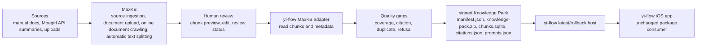

# MaxKB Lightweight Knowledge Replacement

## Decision

RAGFlow abandoned. WeKnora is not the target for the new chunk-management
backend.

MaxKB is the Primary candidate for the next validation slice. The goal is not to
adopt another chat runtime. The goal is to replace the current raw chunk editing
and vendor-specific export surface with a lighter open-source system for source
ingestion, chunk creation, chunk review, and retrieval preview.

`yi-flow-knowledge-base` remains responsible for the signed Knowledge Pack
contract consumed by the iOS app.

## Why MaxKB First

MaxKB describes itself as an open-source enterprise-grade agent platform with a
RAG pipeline. The public project description lists document upload, online
document crawling, automatic text splitting, vectorization, and RAG interaction.
Its topic metadata includes PostgreSQL and pgvector, which aligns with the
server-side database direction.

This is a better validation target than RAGFlow for the current problem because
the first job is knowledge-base and chunk-management workflow, not a heavy
document AI platform with a broad service stack.

## fallback candidates

The fallback candidates are retained only as escape hatches if MaxKB fails the
verification slice.

| Candidate | Keep as fallback because | Reject as first target because |
| --- | --- | --- |
| Dify | Mature knowledge-base and external knowledge API surfaces. | It is a broader app/workflow platform and can reintroduce platform sprawl. |
| AnythingLLM | Simple Docker startup and document RAG workspace flow. | It is optimized for document chat workspaces, not signed package export. |
| Open WebUI | Has Workspace Knowledge export and RAG troubleshooting surfaces. | It is primarily an LLM UI; chunk lifecycle control may be too indirect. |
| Postgres + pgvector custom admin | Smallest runtime, maximum control. | It would keep us building the admin system instead of using open-source software. |

## Target Architecture

## Boundaries

- MaxKB owns source ingestion, document parsing, chunk creation, chunk review,
  and retrieval preview.
- `yi-flow-knowledge-base` owns export, signing, quality gates, publishing,
  latest, rollback, and preview of published package contents.
- The iOS app does not read directly from MaxKB.
- The iOS app contract remains `manifest.json` plus `knowledge-pack.zip`.
- RAGFlow endpoints, deployment templates, and admin wording must not be
  restored as the active path.
- WeKnora code can remain temporarily as migration history, but WeKnora is not
  the target chunk-management backend for the #30 issue train.

## Export Mapping

The MaxKB adapter must map reviewed MaxKB content into the existing
Knowledge Pack fields.

| yi-flow field | MaxKB source candidate | Rule |
| --- | --- | --- |
| `chunk_id` | segment id, document id plus segment index | Stable, collision-safe, prefixed with `maxkb:` only inside exported package data. |
| `title` | knowledge base name, document title, section title | Must be human-readable in preview and source cards. |
| `path` | dataset/app name plus document path | Must preserve package boundary such as `yi-flow-core` or `moegirl-acgn-faq`. |
| `source` | document source or import channel | Must not collapse external and internal sources. |
| `content` | reviewed chunk/segment text | Empty chunks are rejected. |
| citation URL | document URL or source metadata | Required for external sources. |
| license | source metadata or package default | Required for Moegirl-derived content. |
| source policy | package metadata | Must describe summary/FAQ and no-full-mirror boundaries. |
| review status | MaxKB review metadata or adapter-side approval list | Only reviewed chunks can publish. |

The generated package still includes `citations.json` and `prompts.json`.
`prompts.json` must preserve the preview and golden-question workflow used by
the app-side acceptance tests.

## verification slice

#31 is not complete until the following is proven with a repeatable command or
documented transcript:

1. MaxKB can run in a bounded Docker environment without exposing internal
   service ports.
2. A sample source can be loaded through document upload or online document
   crawling.
3. MaxKB produces inspectable chunks or segments through automatic text
   splitting.
4. A reviewer can inspect the produced chunk text before export.
5. Either HTTP API access or controlled database export can list knowledge
   bases, documents, chunks, source metadata, and review state.
6. A 20-chunk sample can be converted to the canonical fields above.
7. The resulting sample can be dry-run packaged without changing the iOS app.

## Quality Gates

MaxKB-sourced packages must preserve the current gate bar:

- Top-5 retrieval hit rate >= 85%.
- citation rate >= 95%.
- duplicate answer rate < 5%.
- out-of-domain refusal pass rate >= 90%.
- missing citation count = 0 for external packages.
- unsupported entity count = 0 for golden eval.

## Operational Notes

- Public ingress should expose only HTTPS.
- PostgreSQL and pgvector should stay private.
- Server credentials, OAuth secrets, database passwords, API tokens, and signing
  keys must not be written to GitHub issues, commits, logs, or docs.
- If MaxKB cannot expose a stable API or database export path for chunks, the
  fallback decision must be recorded before switching to Dify, AnythingLLM, or
  Open WebUI.

## Source Pointers

- MaxKB GitHub: https://github.com/1Panel-dev/MaxKB
- pgvector GitHub: https://github.com/pgvector/pgvector
- Dify external knowledge base docs: https://docs.dify.ai/en/use-dify/knowledge/connect-external-knowledge-base
- AnythingLLM Docker quickstart: https://docs.anythingllm.com/installation-docker/quickstart
- Open WebUI Knowledge docs: https://docs.openwebui.com/features/workspace/knowledge/
