# WeKnora Reviewed Chunk Export

This document defines the reviewed export path from Tencent WeKnora chunks into a signed yi-flow Knowledge Pack.

## Decision

Remote WeKnora improves online retrieval, but the iOS app still needs a signed, offline, rollback-safe Knowledge Pack. The export path only accepts reviewed chunks and then reuses the existing Knowledge Pack builder.

```mermaid
flowchart LR
  Reviewer["Human Review"] --> ExportJSON["Reviewed WeKnora Chunk JSON"]
  ExportJSON --> AdminAPI["/admin/api/kb/:kb_id/weknora/export-publish"]
  AdminAPI --> Mapper["Field Mapper + Citation Builder"]
  Mapper --> Builder["Existing Knowledge Pack Builder"]
  Builder --> Package["chunks.sqlite + vector.index + citations.json + prompts.json"]
  Package --> Manifest["manifest.json + sha256 + Ed25519 signature"]
  Manifest --> Latest["Published latest version"]
  Latest --> App["iOS App Knowledge Pack Update"]
```



## Admin API

```http
POST /admin/api/kb/<kb_id>/weknora/export-publish
Authorization: Bearer <ADMIN_TOKEN>
Content-Type: application/json
```

Minimal payload:

```json
{
  "version": "2026.06.22.weknora",
  "source": "Tencent WeKnora",
  "license": "reviewed internal knowledge",
  "source_policy": "reviewed chunks only; preserve source URL and license; no unreviewed full-article mirror",
  "chunks": [
    {
      "id": "chunk-remote-001",
      "content": "Reviewed summary content.",
      "knowledge_id": "doc-001",
      "knowledge_title": "Source title",
      "knowledge_filename": "source/path.md",
      "knowledge_source": "manual-review",
      "score": 0.93,
      "metadata": {"url": "https://example.com/source"},
      "reviewed": true
    }
  ],
  "prompts": [
    {"id": "source-check", "title": "Verify source", "question": "What does Source title say?"}
  ]
}
```

## Mapping

| WeKnora export field | Knowledge Pack field | Rule |
| --- | --- | --- |
| `id` | `chunk_id` | Prefix with `weknora:` unless already prefixed. |
| `knowledge_title` | `title` | Fallback to `knowledge_filename`, `knowledge_id`, then `id`. |
| `knowledge_filename` | `path` | Stored under `weknora/<slug>`. |
| `knowledge_source` | `source` | Stored as `weknora:<source>`. |
| `content` | `content` | Preserved, with source URL, license, and export policy appended. |
| `metadata.url`, `metadata.source_url`, or `url` | `citations.json` and content source line | Preserve public source URL when available. |
| `score` | `citations.json` | Retained for audit context, not used as app ranking. |
| `reviewed` | review gate | Must be `true`; otherwise export is rejected. |

## License Boundary

- Do not export unreviewed chunks.
- Do not mirror full third-party articles into Knowledge Packs.
- For Moegirl or other third-party sources, export summary chunks only and preserve source URL plus license.
- The generated `citations.json` must retain `source`, `license`, `source_policy`, `weknora_id`, and `review_status`.
- The server still generates `chunks.sqlite`, `vector.index`, `knowledge-pack.zip`, `manifest.json`, SHA256, and Ed25519 signature through the existing builder.

## Verification

Run:

```bash
go test ./...
scripts/verify-knowledge-base-server.sh
```

The regression suite includes a fake reviewed WeKnora chunk fixture that publishes a smoke Knowledge Pack, verifies preview content, verifies source URL and license metadata, and checks manifest hash/signature.
