# WeKnora Reviewed Chunk Export

This document defines the reviewed export path from Tencent WeKnora chunks into a signed yi-flow Knowledge Pack.

## Decision

Remote WeKnora improves online retrieval, but the iOS app still needs a signed, offline, rollback-safe Knowledge Pack. The export path only accepts reviewed chunks and then reuses the existing Knowledge Pack builder.

```mermaid
flowchart LR
  Reviewer["Human Review"] --> ExportJSON["Reviewed WeKnora Chunk JSON"]
  ExportJSON --> AdminAPI["/admin/api/kb/:kb_id/weknora/export-publish"]
  AdminAPI --> Mapper["Field Mapper + Citation Builder"]
  Mapper --> Builder["Existing Knowledge Pack Builder"]
  Builder --> Package["chunks.sqlite + vector.index + citations.json + prompts.json"]
  Package --> Manifest["manifest.json + sha256 + Ed25519 signature"]
  Manifest --> Latest["Published latest version"]
  Latest --> App["iOS App Knowledge Pack Update"]
```



## Knowledge Bases

| yi-flow service `kb_id` | WeKnora KB ID | WeKnora KB name | Source boundary |
| --- | --- | --- | --- |
| `yi-flow-core` | `yi-flow-core-reviewed` | `Yi Flow Core` | Internal yi-flow product, runtime, agent, model, tool, release, and knowledge-pack operations only. It must not contain Moegirl, ACGN, game, fan-wiki, or other third-party encyclopedia content. |
| `moegirl-acgn-faq` | `moegirl-acgn-faq-reviewed` | `Moegirl ACGN FAQ` | Derived summary/FAQ chunks from `https://zh.moegirl.org.cn` only. It must not contain yi-flow internal product documentation. |

The seed export format for `yi-flow-core` is stored at `knowledge-packs/yi-flow-core/weknora-export.seed.json`. The bounded sample export for `moegirl-acgn-faq` is stored at `knowledge-packs/moegirl-acgn-faq/weknora-export.sample.json`. These files are reviewed WeKnora import/export templates, not generated app packages. The server still generates `chunks.sqlite`, `vector.index`, `knowledge-pack.zip`, and `manifest.json`.

## Admin API

```http
POST /admin/api/kb/<kb_id>/weknora/export-publish
Authorization: Bearer <ADMIN_TOKEN>
Content-Type: application/json
```

Minimal payload:

```json
{
  "version": "2026.06.22.weknora",
  "source": "Tencent WeKnora",
  "license": "reviewed internal knowledge",
  "source_policy": "reviewed chunks only; preserve source URL and license; no unreviewed full-article mirror",
  "chunks": [
    {
      "id": "chunk-remote-001",
      "content": "Reviewed summary content.",
      "knowledge_id": "doc-001",
      "knowledge_title": "Source title",
      "knowledge_filename": "source/path.md",
      "knowledge_source": "manual-review",
      "score": 0.93,
      "metadata": {"source_url": "https://example.com/source"},
      "review_status": "reviewed",
      "reviewed": true
    }
  ],
  "prompts": [
    {"id": "source-check", "title": "Verify source", "question": "What does Source title say?"}
  ]
}
```

## Mapping

| WeKnora export field | Knowledge Pack field | Rule |
| --- | --- | --- |
| `id` | `chunk_id` | Prefix with `weknora:` unless already prefixed. |
| `knowledge_title` | `title` | Fallback to `knowledge_filename`, `knowledge_id`, then `id`. |
| `knowledge_filename` | `path` | Stored under `weknora/<slug>`. |
| `knowledge_source` | `source` | Stored as `weknora:<source>`. |
| `content` | `content` | Preserved, with source URL, license, and export policy appended. |
| `metadata.url`, `metadata.source_url`, or `url` | `citations.json` and content source line | Required. Preserve public source URL for attribution and audit. |
| `score` | `citations.json` | Retained for audit context, not used as app ranking. |
| `review_status` or `reviewed` | review gate | Must resolve to `reviewed`; otherwise export is rejected. Prefer explicit `review_status: "reviewed"`. |
| `license` or payload `license` | `citations.json` and content license line | Required. For Moegirl, must be `CC BY-NC-SA 3.0 CN`. |
| `source_policy` or payload `source_policy` | `citations.json` and content policy line | Required. For Moegirl, must be summary-only with no full-article mirror and no AI training. |

## Moegirl Crawl Metadata

`moegirl-acgn-faq` exports must remain summary-only. Each reviewed chunk must include page attribution metadata either as top-level fields or under `metadata`:

| Field | Requirement |
| --- | --- |
| `metadata.source_url` / `metadata.url` / `url` | Must be a canonical `https://zh.moegirl.org.cn/...` page URL. |
| `metadata.page_id` / `page_id` | Required MediaWiki page id. |
| `metadata.revision_id` / `revision_id` | Required MediaWiki revision id. |
| `metadata.touched` / `touched` | Required MediaWiki touched timestamp. |
| `metadata.categories` / `categories` | Required non-empty category list. |
| `metadata.fetched_at` / `fetched_at` | Required fetch timestamp. |

These fields are converted to `citations.crawl_manifest` so package audit can verify attribution before publish.

## License Boundary

- Do not export unreviewed chunks.
- Do not mirror full third-party articles into Knowledge Packs.
- For Moegirl or other third-party sources, export summary-only chunks and preserve source URL plus license.
- The `moegirl-acgn-faq` source policy must include `no full-article mirror` and `no AI training`.
- The generated `citations.json` must retain `source`, `license`, `source_policy`, `weknora_id`, and `review_status`.
- The server still generates `chunks.sqlite`, `vector.index`, `knowledge-pack.zip`, `manifest.json`, SHA256, and Ed25519 signature through the existing builder.

## Verification

Run:

```bash
go test ./...
scripts/verify-knowledge-base-server.sh
```

The regression suite includes a fake reviewed WeKnora chunk fixture that publishes a smoke Knowledge Pack, verifies preview content, verifies source URL and license metadata, and checks manifest hash/signature.
