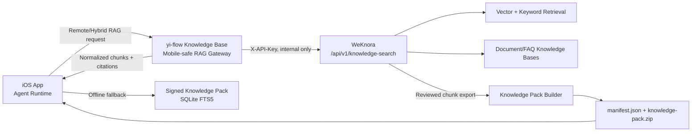

# WeKnora RAG POC

This document defines the first validation slice for using Tencent WeKnora as a server-side RAG engine for yi-flow.

## Decision

WeKnora is a server-side retrieval engine for online and curated workflows. It is not embedded into the iOS app.

The app keeps the signed Knowledge Pack path as the offline and rollback-safe baseline. WeKnora can improve online retrieval quality, and later export reviewed chunks back into a signed Knowledge Pack.



## Official WeKnora Surface Used By This POC

The POC uses the no-LLM search API so yi-flow can keep its own Agent prompt, evidence policy, and citations.

- Startup: `docker compose up -d`
- Default Web UI: `http://localhost`
- Default backend API: `http://localhost:8080`
- Health check: `GET /health`
- API prefix: `/api/v1`
- Auth header: `X-API-Key: <tenant API key>`
- Retrieval endpoint: `POST /api/v1/knowledge-search`

Minimal retrieval request:

```json
{
  "query": "知识包更新路径是什么",
  "knowledge_base_id": "kb-xxxxxxxx"
}
```

Expected response shape:

```json
{
  "success": true,
  "data": [
    {
      "id": "chunk-00000001",
      "content": "命中的分块文本",
      "knowledge_id": "knowledge-00000001",
      "knowledge_title": "来源知识标题",
      "score": 0.95,
      "knowledge_filename": "guide.md",
      "knowledge_source": "manual"
    }
  ]
}
```

## POC Deployment Rules

1. Run WeKnora behind an internal network, VPN, or reverse proxy with access control.
2. Do not expose WeKnora admin UI or raw API directly to the public internet.
3. Do not put WeKnora admin/API keys into the iOS app.
4. The future app-facing endpoint must be a yi-flow gateway with a restricted app token and a stable response contract.
5. Do not download large local models for this POC. Use API-backed model, embedding, and rerank providers when needed.

## Minimal POC Steps

```bash
git clone https://github.com/Tencent/WeKnora.git
cd WeKnora
cp .env.example .env
docker compose up -d
```

Open `http://localhost`, create/login to a workspace, create a knowledge base, upload or create a small test document, and obtain the tenant API key from the web UI.

Then run the yi-flow smoke script:

```bash
WEKNORA_BASE_URL=http://localhost:8080 \
WEKNORA_API_KEY=sk-xxxx \
WEKNORA_KB_ID=kb-xxxx \
WEKNORA_QUERY="知识包更新路径是什么" \
scripts/verify-weknora-poc.sh
```

If `WEKNORA_API_KEY` or `WEKNORA_KB_ID` is missing, the script only validates `/health` and skips retrieval.

## Evaluation Baseline

Use `docs/rag/eval-questions.json` as the shared question set for:

- local Knowledge Pack / FTS5
- WeKnora `/api/v1/knowledge-search`
- future yi-flow RAG gateway
- future iOS Hybrid RAG real-device smoke

Minimum pass before app integration:

- WeKnora health check succeeds.
- At least one seeded KB can answer the smoke query with non-empty `data`.
- Each result can map to yi-flow fields: `chunk_id`, `title`, `path`, `source`, `content`, `score`.
- Remote failures are classified as timeout, unauthorized, upstream error, empty result, or misconfiguration.

## Mapping To yi-flow App Contract

| WeKnora field | yi-flow field | Notes |
| --- | --- | --- |
| `id` | `chunk_id` | Prefix with `weknora:` in the gateway if collision is possible. |
| `knowledge_title` | `title` | Fallback to `knowledge_filename`, then `knowledge_id`. |
| `knowledge_filename` | `path` | Fallback to `knowledge_id`. |
| `knowledge_source` | `source` | Include `weknora` provider marker in gateway metadata. |
| `content` | `content` | Trim to app-safe max length in the gateway. |
| `score` | `score` | Preserve numeric value; normalize only if necessary. |

## Mobile-safe Gateway

The app-facing endpoint is:

```http
POST /rag/api/query
Authorization: Bearer <RAG_GATEWAY_TOKEN>
Content-Type: application/json
```

Request:

```json
{
  "kb_id": "yi-flow-core",
  "query": "知识包更新路径是什么",
  "top_k": 5,
  "mode": "hybrid"
}
```

Response:

```json
{
  "provider": "weknora",
  "status": "ok",
  "knowledge_version": "remote:weknora:kb-xxxxxxxx",
  "query": "知识包更新路径是什么",
  "chunks": [
    {
      "chunk_id": "weknora:chunk-00000001",
      "title": "知识包更新路径",
      "path": "runtime/update.md",
      "source": "weknora:manual",
      "content": "命中的分块文本",
      "score": 0.95
    }
  ],
  "latency_ms": 123
}
```

Configuration:

```bash
RAG_GATEWAY_TOKEN=replace-with-app-facing-token
WEKNORA_BASE_URL=http://weknora-app:8080
WEKNORA_API_KEY=sk-xxxx
WEKNORA_KB_MAP=yi-flow-core=kb-xxxx,moegirl-acgn-summary=kb-yyyy
WEKNORA_TIMEOUT=10s
RAG_GATEWAY_TOP_K_MAX=8
```

`WEKNORA_KB_ID` is accepted as a shorthand for mapping `yi-flow-core` when only one KB is being tested.

Gateway audit logs are emitted as one line per accepted query:

```text
event=rag_gateway_query kb_id=yi-flow-core provider=weknora status=ok query_hash=<sha256> latency_ms=123 chunks=3
```

The log intentionally records the query hash instead of the raw query, and never includes the app-facing token or the server-side WeKnora API key.

Gateway smoke:

```bash
RAG_GATEWAY_BASE_URL=http://127.0.0.1:18085 \
RAG_GATEWAY_TOKEN=replace-with-app-facing-token \
RAG_GATEWAY_KB_ID=yi-flow-core \
scripts/verify-weknora-gateway.sh
```

## Open Questions For Later Issues

- Whether the production gateway should call `/knowledge-search` directly or use the WeKnora CLI/MCP layer.
- Whether one WeKnora KB maps one-to-one to a yi-flow `kb_id`, or whether one yi-flow KB fans out to multiple WeKnora KBs.
- Whether remote RAG should synthesize server-side answers or always return raw chunks to the app. The current POC uses raw chunks only.
